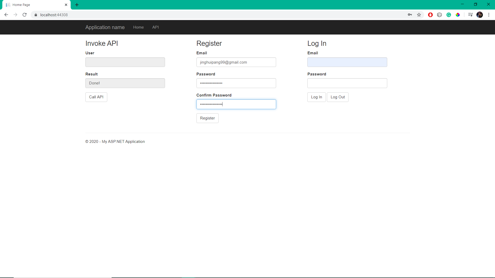
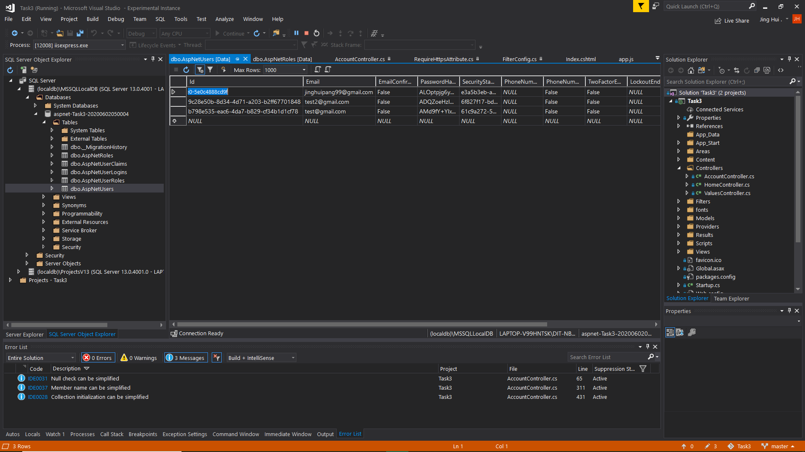
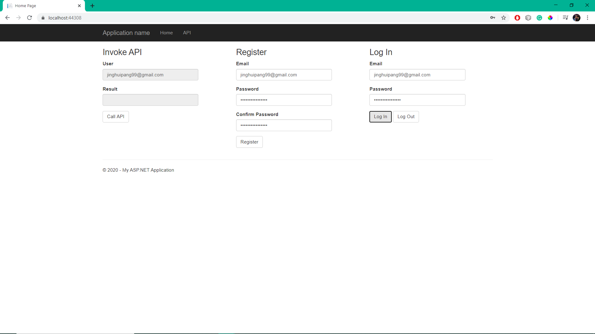
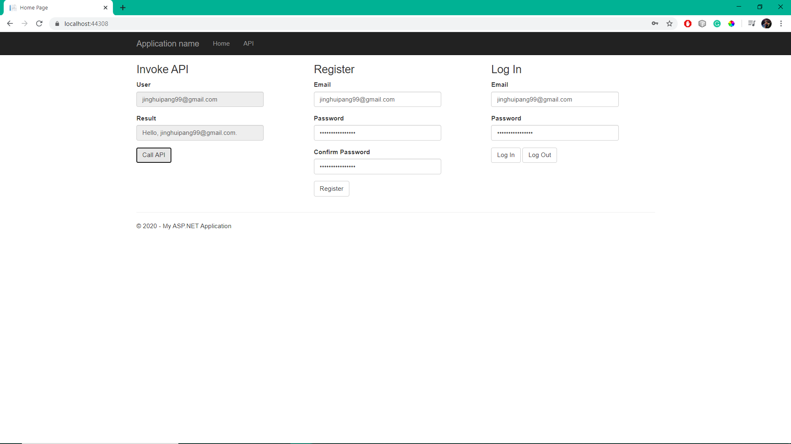
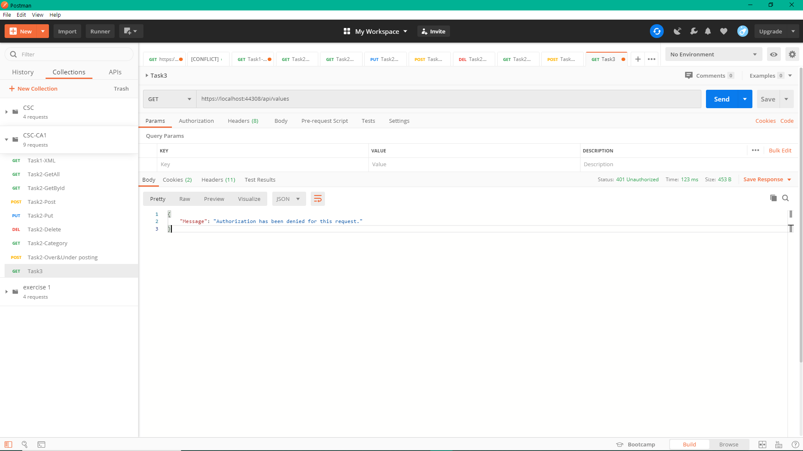
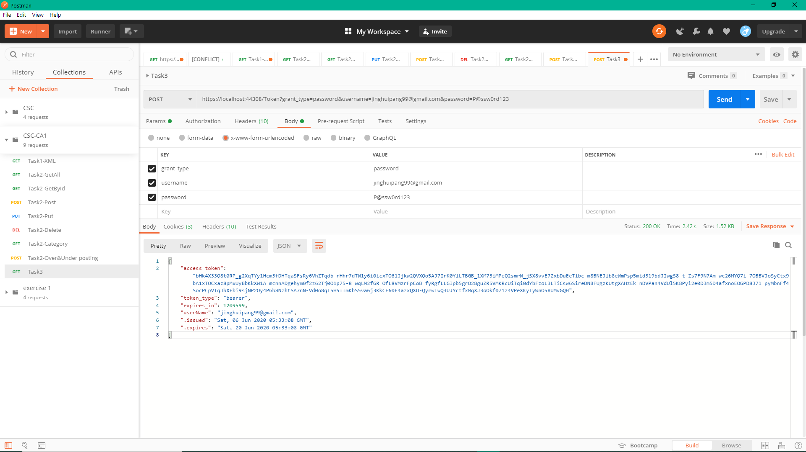
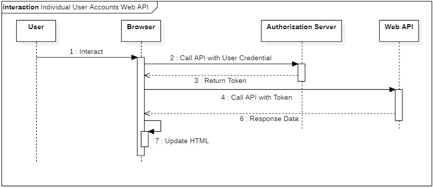

# t3

Pang Jing Hui | P1845259

## Web API Document
| No. | HTTP Method  | Route | Description |
| ------------- | ------------- | ------------- | ------------- |
| 1. | GET | api/Values | Return a string message, "Hello, {userName}." |
| 2. | GET | api/Account/UserInfo | Retrieve the current user information. |
| 3. | POST | api/Account/Logout	| Log out of the current account. |
| 4. | GET | api/Account/ManageInfo?returnUrl={returnUrl}&generateState={generateState} | Return ManageInfoViewModal |
| 5. | POST | api/Account/ChangePassword | Change the password of the current user account. |
| 6. | POST | api/Account/SetPassword | Create a password for the account. |
| 7. | POST | api/Account/AddExternalLogin | Add external login account. |
| 8. | POST | api/Account/RemoveLogin | Perform RemovePasswordAsync or RemoveLoginAsync |
| 9. | GET | api/Account/ExternalLogin?provider={provider}&error={error} | External log in with other platforms |
| 10. | GET | api/Account/ExternalLogins?returnUrl={returnUrl}&generateState={generateState} | Log in with the external credentials and return url and state. |
| 11. | POST | api/Account/Register | Register a user account. |
| 12. | POST | api/Account/RegisterExternal | Register a user account with external credentials. |

## Browser testing
### 1. Register a user account:

### 2. User account in local database:

### 3. Login into a user account:

### 4. Call API:

## Postman testing
### 1. Call API without Token:

If you try to call the api without the token of a user account, access will be denied.

### 2. Get Token from a user account:

The access_token and token_type are the required values to proceed authorization.

### 3. Call API with Token:

KEY = Authorization, VALUE = "token_type" + " " + "access_token"

# Sequence Diagrams

Example: The user is trying to login with name and password. The website sends these user credentials to the authorization server. The authorization server authenticates the credentials and returns an access token. To access a protected resource, the browser includes the access token in the Authorization header of the HTTP request. 

### Note for myself:
#### AccountController
Provides a Web API endpoint for managing user accounts. The Register action is the only one that we used in this tutorial. Other methods on the class support password reset, social logins, and other functionality.
#### ApplicationUser
Defined in /Models/IdentityModels.cs. This class is the EF model for user accounts in the membership database.
#### ApplicationUserManager
Defined in /App_Start/IdentityConfig.cs This class derives from UserManager and performs operations on user accounts, such as creating a new user, verifying passwords, and so forth, and automatically persists changes to the database.
#### ApplicationOAuthProvider
This object plugs into the OWIN middleware, and processes events raised by the middleware. It derives from OAuthAuthorizationServerProvider.

# References:
1. http://mycsc.net/uncategorized/web-api-2-security-authentication-bearer-token-tutorial/
2. https://www.youtube.com/watch?v=tbvxFW4UJdU
